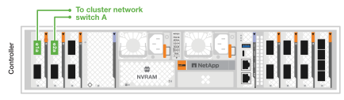
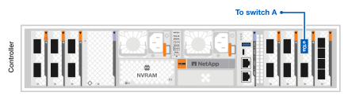
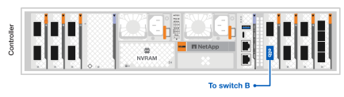

= 為您的 AFX 2K 儲存系統連接硬體
:allow-uri-read: 
:icons: font
:imagesdir: ../media/

[role="lead"]
安裝好 AFX 2K 儲存系統的機架硬體後，安裝控制器的網路纜線，並連接控制器與儲存櫃之間的纜線。

.開始之前
有關將儲存系統連接到網路交換器的信息，請聯絡您的網路管理員。

.關於此任務
* 這些程式顯示了常見的配置。具體的佈線取決於您為儲存系統訂購的組件。有關全面的配置詳細資訊和插槽優先級，請參閱link:https://hwu.netapp.com["NetAppHardware Universe"^]。
* AFX 2K 控制器上的 I/O 插槽編號為 1 到 11。
+
image::../media/drw_afx_2k_rear_slots_ieops-2862.svg[AFX 控制器上的插槽編號]

+
[cols="10%,23%,10%,24%,10%,23%"]
|===
| 插槽號 | I/O插槽 | 插槽號 | I/O插槽 | 插槽號 | I/O插槽 

 a| 
image::../media/icon_round_1.svg[標註編號 1]
| HA  a| 
image::../media/icon_round_4.svg[圖說編號 4]

image::../media/icon_round_5.svg[圖說編號 5]
| NVRAM12  a| 
image::../media/icon_round_9.svg[圖說編號 9]
| 網路 

 a| 
image::../media/icon_round_2.svg[標註編號 2]
| 簇  a| 
image::../media/icon_round_6.svg[圖說編號 6]

image::../media/icon_round_7.svg[圖說編號 7]
| NVRAM12-EX  a| 
image::../media/icon_round_10.svg[圖說編號 10]
| 儲存 

 a| 
image::../media/icon_round_3.svg[圖說編號 3]
| 網路  a| 
image::../media/icon_round_8.svg[圖說編號 8]
| 儲存  a| 
image::../media/icon_round_11.svg[圖說編號 11]
| （*可選*）用於額外管理連接的四埠 25GbE SFP28 
|===
* 佈線圖形顯示箭頭圖標，指示將連接器插入連接埠時電纜連接器拉片的正確方向（向上或向下）。
+
插入連接器時，您應該感覺到它咔噠一聲到位；如果沒有感覺到咔噠一聲，請將其取出，翻轉並重試。

+
image:../media/drw_cable_pull_tab_direction_ieops-1699.svg["電纜拉片方向"]

+
[NOTE]
====
連接器組件很精密，安裝到位時要小心。

====
* 當佈線到光纖連接時，先將光纖收發器插入控制器端口，然後再佈線到交換器端口。
* AFX 2K 儲存系統採用 400GbE 線纜。控制器和交換器之間使用 400GbE 連接。儲存機架和交換器之間使用 4x100GbE 分線線纜，其中 100GbE 連接連接至硬碟機架連接埠。
+
機架儲存連接可連接至交換器上的任一 100GbE 分支連接埠。HA/叢集連線可連接至交換器上的任一 400GbE 連接埠。所有「a」控制器連接埠均連接至交換器 A，所有「b」控制器連接埠均連接至交換器 B。

== 步驟 1：將控制器連接到管理網絡

將每個控制器上的管理（扳手）連接埠連接到任一管理交換器，或直接將它們連接到您的管理網路。

使用 1000BASE-T RJ-45 電纜將每個控制器上的管理（扳手）連接埠連接到管理網路交換器。

image::../media/oie_cable_rj45.png[RJ-45 電纜]

*1000BASE-T RJ-45 電纜*

image::../media/drw_afx_2k_management_connection_ieops-2863.svg[連接到您的管理網絡]

IMPORTANT: 請勿插入電源線。

.步驟
. 連接到管理網路。

== 步驟 2：將控制器連接到主機網絡

將乙太網路模組連接埠連接到您的主機網路。

此過程可能會因您的 I/O 模組配置而異。以下是一些典型的主機網路佈線範例。看link:https://hwu.netapp.com["NetAppHardware Universe"^]適合您的特定係統配置。

.步驟
. 將下列連接埠連接到乙太網路資料網路交換器 A。
+
** 控制器
+
*** e3a
*** e9a
+
*400GbE 纜線*

+
image::../media/oie_cable100_gbe_qsfp28.png[400 Gb 乙太網路線]

+
image::../media/drw_afx_2k_host_switch_a_ieops-2864.svg[乙太網路電纜]

. 將下列連接埠連接至乙太網路資料網路交換器 B。
+
** 控制器
+
*** e3b
*** e9b
+
*400GbE 纜線*

+
image::../media/oie_cable100_gbe_qsfp28.png[400 Gb 乙太網路線]

+
image::../media/drw_afx_2k_host_switch_b_ieops-2865.svg[乙太網路電纜]

== 步驟 3：連接叢集和 HA 連線

使用叢集和 HA 互連電纜將連接埠 e1a 和 e2a 連接至交換器 A，將連接埠 e1b 和 e2b 連接至交換器 B。e1a/e1b 連接埠用於 HA 連接，e2a/e2a 連接埠用於叢集連接。

.步驟
. 將下列控制器連接埠連接到叢集網路交換器 A 上的任何非 ISL 連接埠。
+
** 控制器
+
*** e1a（HA）
*** e2a（集群）
+
*400GbE 纜線*

+
image::../media/oie_cable_25Gb_Ethernet_SFP28_ieops-1069.png[叢集 HA 纜線]

+

. 將下列控制器連接埠連接到叢集網路交換器 B 上的任何非 ISL 連接埠。
+
** 控制器
+
*** e1b（HA）
*** e2b（集群）
+
*400GbE 纜線*

+
image::../media/oie_cable_25Gb_Ethernet_SFP28_ieops-1069.png[叢集 HA 纜線]

+
image::../media/drw_afx_2k_cluster_switch_b_ieops-2867.svg[連接叢集纜線至叢集網路]

== 步驟 4：連接控制器和交換器儲存設備之間的電纜

將控制器儲存連接埠連接到交換器。請確保您使用的線纜和連接器與您的交換器相符。請參閱 https://hwu.netapp.com["Hardware Universe"^]以取得更多資訊。

NOTE: 在 AFX 2K 儲存系統配置中，控制器上的 e10b 和 e8a 連接埠未用於儲存連線。

.步驟
. 將下列儲存連接埠連接到交換器 A 上的任意非 ISL 連接埠。
+
** 控制器
+
*** e10a
+
*400GbE 纜線*

+
image::../media/oie_cable100_gbe_qsfp28.png[100 Gb 電纜]

+

. 將下列儲存連接埠連接到交換器 B 上的任意非 ISL 連接埠。
+
** 控制器
+
*** e8b
+
*400GbE 纜線*

+
image::../media/oie_cable100_gbe_qsfp28.png[100 Gb 電纜]

+

== 步驟 5：架設機架到交換器的連接線

將 NX224 儲存架連接到交換器上的 100GbE 分支連接埠。

有關儲存系統支援的最大架數量以及所有佈線選項，請參閱link:https://hwu.netapp.com["NetAppHardware Universe"^]。

.步驟
. 將下列機架連接埠連接至交換器 A 和交換器 B 上模組 A 的任意分支連接埠。
+
** 模組 A 到交換器 A 的連接
+
*** e1a
*** e2a
*** e3a
*** e4a

** 模組 A 到交換器 B 的連接
+
*** e1b
*** e2b
*** e3b
*** e4b
+
*100GbE 電纜*

+
image::../media/oie_cable100_gbe_qsfp28.png[100 Gb 電纜]

+
image::../media/drw_afx_shelf_cabling_a_ieops-2356.svg[電纜架至交換器 A 和交換器 B]

. 將下列機架連接埠連接到交換器 A 和交換器 B 上的任意分支連接埠，以用於模組 B。
+
** 模組 B 到交換器 A 的連接
+
*** e1a
*** e2a
*** e3a
*** e4a

** 模組 B 到交換器 B 的連接
+
*** e1b
*** e2b
*** e3b
*** e4b
+
*100GbE 電纜*

+
image::../media/oie_cable100_gbe_qsfp28.png[100 Gb 電纜]

+
image::../media/drw_afx_shelf_cabling_b_ieops-2357.svg[電纜架至交換器 A 和交換器 B]

.下一步是什麼？
連接硬體後，link:power-on-configure-switch.html["打開電源並配置交換機"] 。
