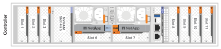
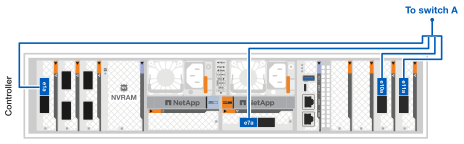
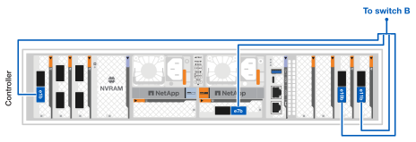

= 連接 AFX 1K 儲存系統的硬體
:allow-uri-read: 
:icons: font
:imagesdir: ../media/

[role="lead"]
安裝 AFX 1K 儲存系統的機架硬體後，安裝控制器的網路電纜，並連接控制器和儲存架之間的電纜。

.開始之前
有關將儲存系統連接到網路交換器的信息，請聯絡您的網路管理員。

.關於此任務
* 這些程式顯示了常見的配置。具體的佈線取決於您為儲存系統訂購的組件。有關全面的配置詳細資訊和插槽優先級，請參閱link:https://hwu.netapp.com["NetAppHardware Universe"^]。
* AFX 控制器上的 I/O 插槽編號為 1 到 11。
+

* 佈線圖形顯示箭頭圖標，指示將連接器插入連接埠時電纜連接器拉片的正確方向（向上或向下）。
+
插入連接器時，您應該感覺到它咔噠一聲到位；如果沒有感覺到咔噠一聲，請將其取出，翻轉並重試。

+
image:../media/drw_cable_pull_tab_direction_ieops-1699.svg["電纜拉片方向"]

+
[NOTE]
====
連接器組件很精密，安裝到位時要小心。

====
* 當佈線到光纖連接時，先將光纖收發器插入控制器端口，然後再佈線到交換器端口。
* AFX 1K 儲存系統在叢集和儲存網路上使用 4x100GbE 分支電纜。 400GbE 連接與交換器連接埠相連，100GbE 連接與控制器和驅動器架連接埠相連。儲存和 HA/叢集連線可以與交換器上的任何非 ISL 連接埠建立。
+
對於給定的 4x100GbE 分支電纜連接到特定交換器端口，您可以使用這條分支電纜將給定控制器的所有四個端口連接到交換器。

+
** 1 個 HA 連接埠（插槽 1）
** 1 x 叢集連接埠（插槽 7）
** 2 個儲存連接埠（插槽 10、11）
+
所有「a」連接埠連接到交換器A，所有「b」連接埠連接到交換器B。

NOTE: Cisco Nexus 9332D-GX2B 和 9364D-GX2A 交換器設定到 AFX 1K 儲存系統需要 4x100GbE 分支電纜連接。

== 步驟 1：將控制器連接到管理網絡

將每個控制器上的管理（扳手）連接埠連接到任一管理交換器，或直接將它們連接到您的管理網路。

使用 1000BASE-T RJ-45 電纜將每個控制器上的管理（扳手）連接埠連接到管理網路交換器。

image::../media/oie_cable_rj45.png[RJ-45 電纜]

*1000BASE-T RJ-45 電纜*

image::../media/drw_afx_management_connection_ieops-2815.svg[連接到您的管理網絡]

IMPORTANT: 請勿插入電源線。

. 連接到主機網路。

== 步驟 2：將控制器連接到主機網絡

將乙太網路模組連接埠連接到您的主機網路。

此過程可能會因您的 I/O 模組配置而異。以下是一些典型的主機網路佈線範例。看link:https://hwu.netapp.com["NetAppHardware Universe"^]適合您的特定係統配置。

.步驟
. 將下列連接埠連接到乙太網路資料網路交換器 A。
+
** 控制器（Example）
+
*** e2a
*** e3a
+
*100GbE 電纜*

+
image::../media/oie_cable100_gbe_qsfp28.png[100 Gb 乙太網路電纜]

+
image::../media/drw_afx_network_cabling_a_ieops-2813.svg[乙太網路電纜]

. 將下列連接埠連接至乙太網路資料網路交換器 B。
+
** 控制器（Example）
+
*** e2b
*** e3b
+
*100GbE 電纜*

+
image::../media/oie_cable100_gbe_qsfp28.png[100 Gb 乙太網路電纜]

+
image::../media/drw_afx_network_cabling_b_ieops-2814.svg[乙太網路電纜]

== 步驟 3：將叢集、HA 和儲存連接線連接到交換器 A

使用 4x100GbE 分線電纜將控制器上的叢集、HA 和儲存連接埠連接到網路交換器 A。叢集和 HA 互連電纜將連接埠 e1a 和 e7a 連接到交換器 A。e1a 連接埠用於 HA 連接，e7a 連接埠用於叢集連接。對於儲存連接，請將連接埠 e10a 和 e11a 連接到交換器 A。

請確保您擁有與交換器相符的正確線纜和連接器。請參閱 https://hwu.netapp.com["Hardware Universe"^]以取得更多資訊。

.步驟
. 將下列控制器連接埠連接至網路交換器 A 上的任意非 ISL 連接埠。
+
** 控制器
+
*** e1a（HA）
*** e7a（集群）
*** e10a （Storage）
*** e11a （Storage）
+
*100GbE 電纜*

+
image::../media/oie_cable100_gbe_qsfp28.png[100 Gb 電纜]

+

== 步驟 4：將叢集、HA 和儲存連接線連接到交換器 B

使用 4x100GbE 分線電纜將控制器上的叢集連接埠、HA 連接埠和儲存連接埠連接到網路交換器 B。叢集和 HA 互連電纜將連接埠 e1b 和 e7b 連接到交換器 B。e1b 連接埠用於 HA 連接，e7b 連接埠用於叢集連接。對於儲存連接，請將連接埠 e10b 和 e11b 連接到交換器 B。

請確保您擁有與交換器相符的正確線纜和連接器。請參閱 https://hwu.netapp.com["Hardware Universe"^]以取得更多資訊。

. 將下列控制器連接埠連接至網路交換器 B 上的任意非 ISL 連接埠。
+
** 控制器
+
*** e1b（HA）
*** e7b（集群）
*** e10b （Storage）
*** e11b （Storage）
+
*100GbE 電纜*

+
image::../media/oie_cable100_gbe_qsfp28.png[100 Gb 電纜]

+

== 步驟 5：架設機架到交換器的連接線

將 NX224 儲存擴充架連接到交換器。

有關儲存系統支援的最大架數量以及所有佈線選項，請參閱link:https://hwu.netapp.com["NetAppHardware Universe"^]。

. 將下列機架連接埠連接至模組 A 的交換器 A 和交換器 B 上的任何非 ISL 連接埠。
+
** 模組 A 到交換器 A 的連接
+
*** e1a
*** e2a
*** e3a
*** e4a

** 模組 A 到交換器 B 的連接
+
*** e1b
*** e2b
*** e3b
*** e4b
+
*100GbE 電纜*

+
image::../media/oie_cable100_gbe_qsfp28.png[100 Gb 電纜]

+
image::../media/drw_afx_shelf_cabling_a_ieops-2356.svg[電纜架至交換器 A 和交換器 B]

. 將下列機架連接埠連接至交換器 A 和交換器 B 上用於模組 B 的任意非 ISL 連接埠。
+
** 模組 B 到交換器 A 的連接
+
*** e1a
*** e2a
*** e3a
*** e4a

** 模組 B 到交換器 B 的連接
+
*** e1b
*** e2b
*** e3b
*** e4b
+
*100GbE 電纜*

+
image::../media/oie_cable100_gbe_qsfp28.png[100 Gb 電纜]

+
image::../media/drw_afx_shelf_cabling_b_ieops-2357.svg[電纜架至交換器 A 和交換器 B]

.下一步是什麼？
連接硬體後，link:power-on-configure-switch.html["打開電源並配置交換機"] 。
