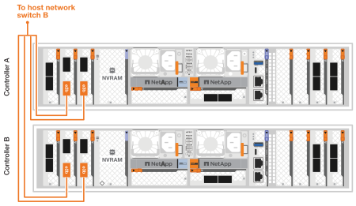
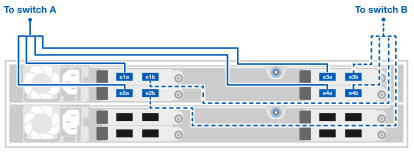

= 連接 AFX 1K 儲存系統的硬體
:allow-uri-read: 
:icons: font
:imagesdir: ../media/

[role="lead"]
安裝 AFX 1K 儲存系統的機架硬體後，安裝控制器的網路電纜，並連接控制器和儲存架之間的電纜。

.開始之前
有關將儲存系統連接到網路交換器的信息，請聯絡您的網路管理員。

.關於此任務
* 這些程式顯示了常見的配置。具體的佈線取決於您為儲存系統訂購的組件。有關全面的配置詳細資訊和插槽優先級，請參閱link:https://hwu.netapp.com["NetAppHardware Universe"^]。
* AFX 控制器上的 I/O 插槽編號為 1 到 11。
+
image::../media/drw_a1K_back_slots_labeled_ieops-2162.svg[AFX 控制器上的插槽編號]

* 佈線圖形顯示箭頭圖標，指示將連接器插入連接埠時電纜連接器拉片的正確方向（向上或向下）。
+
插入連接器時，您應該感覺到它咔噠一聲到位；如果沒有感覺到咔噠一聲，請將其取出，翻轉並重試。

+
image:../media/drw_cable_pull_tab_direction_ieops-1699.svg["電纜拉片方向"]

+
[NOTE]
====
連接器組件很精密，安裝到位時要小心。

====
* 當佈線到光纖連接時，先將光纖收發器插入控制器端口，然後再佈線到交換器端口。
* AFX 1K 儲存系統在叢集和儲存網路上使用 4x100GbE 分支電纜。 400GbE 連接與交換器連接埠相連，100GbE 連接與控制器和驅動器架連接埠相連。儲存和 HA/叢集連線可以與交換器上的任何非 ISL 連接埠建立。
+
對於給定的 4x100GbE 分支電纜連接到特定的交換器端口，您可以透過這條分支電纜將所有 4 個連接埠連接到交換器。

+
** 1 個 HA 連接埠（插槽 1）
** 1 x 叢集連接埠（插槽 7）
** 2 個儲存連接埠（插槽 10、11）
+
所有「a」連接埠連接到交換器 A，所有「b」連接埠連接到交換器 B。

NOTE: Cisco Nexus 9332D-GX2B 和 9364D-GX2A 交換器設定到 AFX 1K 儲存系統需要 4x100GbE 分支電纜連接。

== 步驟 1：將控制器連接到管理網絡

將每個交換器上的管理連接埠連接到任一管理交換器（如果訂購）或將其直接連接到管理網路。

管理連接埠是位於交換器 PSU 側的右上方連接埠。每個交換器的CAT6電纜在安裝完成後都需要穿過直通面板，以連接到管理交換器或管理網路。

使用 1000BASE-T RJ-45 電纜將每個控制器上的管理（扳手）連接埠連接到管理網路交換器。

image::../media/oie_cable_rj45.png[RJ-45 電纜]

*1000BASE-T RJ-45 電纜*

image::../media/drw_afx_management_connection_ieops-2349.svg[連接到您的管理網絡]

IMPORTANT: 請勿插入電源線。

. 連接到主機網路。

== 步驟 2：將控制器連接到主機網絡

將乙太網路模組連接埠連接到您的主機網路。

此過程可能會因您的 I/O 模組配置而異。以下是一些典型的主機網路佈線範例。看link:https://hwu.netapp.com["NetAppHardware Universe"^]適合您的特定係統配置。

.步驟
. 將下列連接埠連接到乙太網路資料網路交換器 A。
+
** 控制器A（範例）
+
*** e2a
*** e3a

** 控制器 B（範例）
+
*** e2a
*** e3a
+
*100GbE 電纜*

+
image::../media/oie_cable100_gbe_qsfp28.png[100 Gb 乙太網路電纜]

+
image::../media/drw_afx_network_cabling_a_ieops-2350.svg[乙太網路電纜]

. 將下列連接埠連接至乙太網路資料網路交換器 B。
+
** 控制器A（範例）
+
*** e2b
*** e3b

** 控制器 B（範例）
+
*** e2b
*** e3b
+
*100GbE 電纜*

+
image::../media/oie_cable100_gbe_qsfp28.png[100 Gb 乙太網路電纜]

+

== 步驟 3：連接集群和 HA

使用群集和 HA 互連電纜將 e1a 和 e7a 連接埠到交換器 A，將 e1b 和 e7b 連接到交換器 B。 e1a/e1b 連接埠用於 HA 連接，e7a/e7b 連接埠用於叢集連接。

.步驟
. 將下列控制器連接埠連接到叢集網路交換器 A 上的任何非 ISL 連接埠。
+
** 控制器A
+
*** e1a
*** e7a

** 控制器B
+
*** e1a
*** e7a
+
*100GbE 電纜*

+
image::../media/oie_cable_25Gb_Ethernet_SFP28_ieops-1069.png[集群 HA 電纜]

+
image::../media/drw_afx_switched_cluster_cabling_a_ieops-2352.svg[將集群連接線連接至集群網絡]

. 將下列控制器連接埠連接到叢集網路交換器 B 上的任何非 ISL 連接埠。
+
** 控制器A
+
*** e1b
*** e7b

** 控制器B
+
*** e1b
*** e7b
+
*100GbE 電纜*

+
image::../media/oie_cable_25Gb_Ethernet_SFP28_ieops-1069.png[集群 HA 電纜]

+
image::../media/drw_afx_switched_cluster_cabling_b_ieops-2353.svg[將集群連接線連接至集群網絡]

== 步驟 4：連接控制器到交換器的儲存連接

將控制器儲存連接埠連接到交換器。確保您的交換器具有正確的電纜和連接器。看 https://hwu.netapp.com["Hardware Universe"^]了解更多。

. 將下列儲存連接埠連接到交換器 A 上的任何非 ISL 連接埠。
+
** 控制器A
+
*** e10a
*** e11a

** 控制器B
+
*** e10a
*** e11a
+
*100GbE 電纜*

+
image::../media/oie_cable100_gbe_qsfp28.png[100 Gb 電纜]

+
image::../media/drw_afx_controller_storage_cable_a_ieops-2354.svg[將控制器記憶體以電纜連接至交換器 A]

. 將下列儲存連接埠連接到交換器 B 上的任何非 ISL 連接埠。
+
** 控制器A
+
*** e10b
*** e11b

** 控制器B
+
*** e10b
*** e11b
+
*100GbE 電纜*

+
image::../media/oie_cable100_gbe_qsfp28.png[100 Gb 電纜]

+

== 步驟 5：架設機架到交換器的連接線

將 NX224 儲存擴充架連接到交換器。

有關儲存系統支援的最大架數量以及所有佈線選項，請參閱link:https://hwu.netapp.com["NetAppHardware Universe"^]。

. 將下列機架連接埠連接至模組 A 的交換器 A 和交換器 B 上的任何非 ISL 連接埠。
+
** 模組 A 到交換器 A 的連接
+
*** e1a
*** e2a
*** e3a
*** e4a

** 模組 A 到交換器 B 的連接
+
*** e1b
*** e2b
*** e3b
*** e4b
+
*100GbE 電纜*

+
image::../media/oie_cable100_gbe_qsfp28.png[100 Gb 電纜]

+

. 將下列機架連接埠連接至交換器 A 和交換器 B 上用於模組 B 的任意非 ISL 連接埠。
+
** 模組 B 到交換器 A 的連接
+
*** e1a
*** e2a
*** e3a
*** e4a

** 模組 B 到交換器 B 的連接
+
*** e1b
*** e2b
*** e3b
*** e4b
+
*100GbE 電纜*

+
image::../media/oie_cable100_gbe_qsfp28.png[100 Gb 電纜]

+
image::../media/drw_afx_shelf_cabling_b_ieops-2357.svg[電纜架至交換器 A 和交換器 B]

.下一步是什麼？
連接硬體後，link:power-on-configure-switch.html["打開電源並配置交換機"] 。
