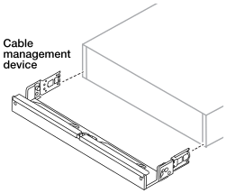

= 安裝 AFX 1K 儲存系統
:allow-uri-read: 
:icons: font
:imagesdir: ../media/

[role="lead"]
安裝交換器後，您應該安裝 AFX 1K 儲存系統的硬體。首先，安裝導軌套件。然後將儲存系統安裝並固定在機櫃或電信機架中。

.開始之前
* 確保您擁有導軌套件隨附的說明書。
* 了解與儲存系統和儲存架的重量相關的安全問題。
* 了解通過儲存系統的氣流從安裝擋板或端蓋的前部進入，並從連接埠所在的後部排出。

.步驟
. 根據需要，請按照套件中包含的說明安裝儲存系統和儲存架的導軌套件。
. 在機櫃或電信機架中安裝並固定控制器：
+
.. 將儲存系統放置到機櫃或電信機架中間的導軌上，然後從底部支撐儲存系統並將其滑入到位。
.. 使用隨附的安裝螺絲將儲存系統固定到機櫃或電信機架上。

. 將邊框安裝到控制器的前面。
. 如果您的 AFX 1K 儲存系統隨附電纜管理設備，請將其連接至儲存系統的後方。
+

. 安裝並固定存放架：
+
.. 將儲存架的背面放置在導軌上，然後從底部支撐架子並將其滑入機櫃或電信機架中。
+
一般來說，儲存架和控制器應安裝在靠近交換器的地方。如果要安裝多個儲存架，請將第一個儲存架直接放置在控制器上方。將第二個儲存架直接放置在控制器下方。對任何額外的儲存架重複此模式。

.. 使用隨附的安裝螺絲將儲存架固定到機櫃或電信機架上。

.下一步是什麼？
安裝 AFX 系統的硬體後，請查看link:afx-cable-overview.html["您的 AFX 1K 儲存系統支援的佈線配置"]。
