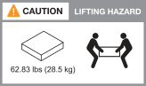

= AFX 1K 儲存系統的安裝要求
:allow-uri-read: 
:icons: font
:imagesdir: ../media/

[role="lead"]
查看 AFX 1K 儲存控制器和儲存架所需的設備以及提升預防措施。

[[equipment-needed-for-install]]
== 安裝所需的設備

要安裝 AFX 1K 儲存系統，您需要以下裝置和工具。

* 存取 Web 瀏覽器來設定您的儲存系統
* 靜電放電 (ESD) 腕帶
* 手電筒
* 具有 USB/串行連接的筆記型電腦或控制台
* 用於設定存放架 ID 的迴紋針或細頭原子筆
* 2 號十字螺絲刀

[[lifting-precautions]]
== 起重註意事項

AFX 儲存控制器和儲存架很重。抬起和移動這些物品時要小心。

[[storage-controller-weights]]
=== 儲存控制器權重

移動或抬起 AFX 1K 儲存控制器時請採取必要的預防措施。

AFX 1K 儲存控制器重量可達 62.83 磅（28.5 公斤）。搬運此儲存控制器時，請使用兩人協助或液壓升降機。

.AFX 1K 控制器吊掛注意事項。

[[storage-shelf-weights]]
=== 倉儲貨架重量

移動或抬起架子時請採取必要的預防措施。

.NX224貨架
--
NX224 磁碟櫃最大重量可達 60.1 磅（27.3 公斤）。搬運磁碟櫃時，請兩人操作或使用液壓升降機。請將所有組件（包括前後組件）放置在磁碟櫃內，以防止磁碟櫃重量不平衡。

.NX224 磁碟櫃搬運注意事項。
image::../media/drw_nx224_lifting_weight_ieops-2437.svg[NX224 NSM100 起吊注意事項]

.相關資訊
* https://library.netapp.com/ecm/ecm_download_file/ECMP12475945["安全資訊和監管通知"^]

.下一步是什麼？
了解硬體需求後，link:prepare-hardware.html["準備安裝您的 AFX 1K 儲存系統"] 。

--