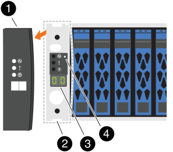

= 啟動 AFX 1K 儲存系統
:allow-uri-read: 
:icons: font
:imagesdir: ../media/

[role="lead"]
安裝 AFX 1K 儲存系統的機架硬體並安裝控制器節點和儲存架的電纜後，應開啟儲存架和控制器節點的電源。

[[step-1-power-on-the-shelf-and-assign-shelf-id]]
== 步驟 1：開啟機架電源並分配機架 ID

每個貨架都有一個獨特的貨架 ID，確保其在您的儲存系統設定中具有區別性。

.關於此任務
* 有效的貨架 ID 為 01 至 99。
* 您必須對機架進行電源循環（拔掉兩條電源線，等待至少 10 秒鐘，然後重新插入）才能使機架 ID 生效。

.步驟
. 首先將電源線連接到架子上，用電源線固定器將其固定到位，然後將電源線連接到不同電路的電源上，從而為架子供電。
+
插入電源後，架子會自動通電並啟動。

. 取下左端蓋即可看到面板後方的架子 ID 按鈕。
+

+
[cols="20%,80%"]
|===

 a| 
image::../media/icon_round_1.png[標註編號 1]
 a| 
擱板端蓋

 a| 
image::../media/icon_round_2.png[[標註 2]
 a| 
貨架面板

 a| 
image::../media/icon_round_3.png[[標註 3]
 a| 
貨架編號

 a| 
image::../media/icon_round_4.png[[標註編號 4]
 a| 
貨架ID按鈕

|===
. 更改貨架ID的第一個數字：
+
.. 將迴紋針或細頭原子筆的拉直端插入小孔，輕輕按下貨架 ID 按鈕。
.. 輕輕按住貨架 ID 按鈕，直到數位顯示器上的第一個數字閃爍，然後放開按鈕。
+
數字在 15 秒內閃爍，啟動貨架 ID 編程模式。

+

NOTE: 如果 ID 閃爍的時間超過 15 秒，請再次按住貨架 ID 按鈕，確保將其完全按下。

.. 按下並釋放貨架 ID 按鈕以增加數字，直到達到所需的數字（從 0 到 9）。
+
每次按下和釋放的時間可以短至一秒鐘。

+
第一個數字繼續閃爍。

. 更改貨架ID的第二個數字：
+
.. 按住按鈕直到數位顯示器上的第二個數字閃爍。
+
數字閃爍最多可能需要三秒鐘。

+
數位顯示器上的第一個數字停止閃爍。

.. 按下並釋放貨架 ID 按鈕以增加數字，直到達到所需的數字（從 0 到 9）。
+
第二個數字繼續閃爍。

. 鎖定所需的號碼並按住貨架 ID 按鈕直到第二個號碼停止閃爍，然後退出編程模式。
+
數字停止閃爍最多可能需要三秒鐘。

+
大約五秒鐘後，數位顯示器上的兩個數字開始閃爍，琥珀色 LED 亮起，提醒您要處理的貨架 ID 尚未生效。

. 將架子進行電源循環至少 10 秒，以使架子 ID 生效。
+
.. 拔掉架子上兩個電源的電源線。
.. 等待 10 秒鐘。
.. 將電源線重新插入機架電源以完成電源循環。
+
只要插入電源線，電源就會開啟。其雙色 LED 應亮起綠色。

. 更換左端蓋。

[[step-2-power-on-the-controller-nodes]]
== 步驟 2：啟動控制節點

打開儲存架並為其分配唯一 ID 後，開啟儲存控制器節點的電源。

.步驟
. 將您的筆記型電腦連接到序列控制台連接埠。這使您可以監控控制器通電時的啟動順序。
+
.. 使用 N-8-1 將筆記型電腦上的序列控制台連接埠設定為 115,200 波特。
+
有關如何設定序列控制台連接埠的說明，請參閱筆記型電腦的線上說明。

.. 將控制台連接線連接到筆記型電腦，然後使用儲存系統隨附的控制台連接線連接控制器上的序列控制台連接埠。
.. 將筆記型電腦連接到管理子網路上的交換器。
+
image::../media/drw_afx_1k_console_connection_ieops-2708.svg[控制台連接]

. 使用管理子網路上的 TCP/IP 位址為筆記型電腦指派一個 TCP/IP 位址。
. 將電源線插入控制器電源，然後將其連接到不同電路的電源。
+
image::../media/drw_affa1k_power_source_icon_ieops-1700.svg[AFX 儲存系統電源連接圖]

+
** 系統開始啟動。初始啟動可能需要長達八分鐘。
** LED 閃爍且風扇啟動，表示控制器正在通電。
** 風扇在啟動時可能會有噪音，這是正常現象。

. 使用每個電源上的固定裝置固定電源線。

[[step-3-verify-the-switch-connections]]
== 步驟 3：驗證交換器連接

從交換器 CLI 驗證連接到叢集連接埠的交換器連接埠是否已啟動，叢集節點是否位於正確的叢集 VLAN 中，以及兩個交換器之間的 ISL 連線是否正常運作。

. 確認連接到叢集連接埠的交換器連接埠已啟動：
+
`show interface brief`

+
您可以使用 `| grep up`篩選輸出，僅顯示已開啟的連接埠。

+
.展示 Cisco Nexus 9332D-GX2B 和 9364D-GX2A 交換器的範例
[%collapsible]
====
[listing, subs="+quotes"]
----
cs1# *show interface brief | grep up*
.
.
Eth1/9/3        1       eth  trunk  up      none                     100G(D) --
Eth1/9/4        1       eth  trunk  up      none                     100G(D) --
Eth1/15/1       1       eth  trunk  up      none                     100G(D) --
Eth1/15/2       1       eth  trunk  up      none                     100G(D) --
Eth1/15/3       1       eth  trunk  up      none                     100G(D) --
Eth1/15/4       1       eth  trunk  up      none                     100G(D) --
Eth1/16/1       1       eth  trunk  up      none                     100G(D) --
Eth1/16/2       1       eth  trunk  up      none                     100G(D) --
Eth1/16/3       1       eth  trunk  up      none                     100G(D) --
Eth1/16/4       1       eth  trunk  up      none                     100G(D) --
Eth1/17/1       1       eth  trunk  up      none                     100G(D) --
Eth1/17/2       1       eth  trunk  up      none                     100G(D) --
Eth1/17/3       1       eth  trunk  up      none                     100G(D) --
Eth1/17/4       1       eth  trunk  up      none                     100G(D) --
.
.
----
====
. 使用下列命令驗證叢集節點是否位於正確的叢集 VLAN 中：
+
`show vlan brief`

+
`show interface trunk`

+
.展示 Cisco Nexus 9332D-GX2B 交換器的範例
[%collapsible]
====
[listing, subs="+quotes"]
----
cs1# *show vlan brief*
VLAN Name                             Status    Ports
---- -------------------------------- --------- -------------------------------
1    default                          active    Po1, Po999, Eth1/31, Eth1/32
                                                Eth1/33, Eth1/34, Eth1/1/1
                                                Eth1/1/2, Eth1/1/3, Eth1/1/4
.
.
.
                                                Eth1/29/4, Eth1/30/1, Eth1/30/2
                                                Eth1/30/3, Eth1/30/4
17   VLAN0017                         active    Eth1/1/1, Eth1/1/2, Eth1/1/3
                                                Eth1/1/4, Eth1/2/1, Eth1/2/2
.
.
.
                                                Eth1/29/3, Eth1/29/4, Eth1/30/1
                                                Eth1/30/2, Eth1/30/3, Eth1/30/4
18   VLAN0018                         active    Eth1/1/1, Eth1/1/2, Eth1/1/3
                                                Eth1/1/4, Eth1/2/1, Eth1/2/2
.
.
.
                                                Eth1/29/3, Eth1/29/4, Eth1/30/1
                                                Eth1/30/2, Eth1/30/3, Eth1/30/4
30   VLAN0030                         active    Eth1/1/1, Eth1/1/2, Eth1/1/3
                                                Eth1/1/4, Eth1/2/1, Eth1/2/2
.
.
.
                                                Eth1/29/3, Eth1/29/4, Eth1/30/1
                                                Eth1/30/2, Eth1/30/3, Eth1/30/4
40   VLAN0040                         active    Eth1/1/1, Eth1/1/2, Eth1/1/3
                                                Eth1/1/4, Eth1/2/1, Eth1/2/2
.
.
.
                                                Eth1/29/3, Eth1/29/4, Eth1/30/1
                                                Eth1/30/2, Eth1/30/3, Eth1/30/4

cs1# *show interface trunk*
--------------------------------------------------------------------------------
Port          Native  Status        Port
              Vlan                  Channel
--------------------------------------------------------------------------------
Eth1/1/1      1       trunking      --
Eth1/1/2      1       trunking      --
Eth1/1/3      1       trunking      --
Eth1/1/4      1       trunking      --
Eth1/2/1      1       trunking      --
Eth1/2/2      1       trunking      --
Eth1/2/3      1       trunking      --
Eth1/2/4      1       trunking      --
.
.
.
Eth1/30/1     none
Eth1/30/2     none
Eth1/30/3     none
Eth1/30/4     none
Eth1/31       none
Eth1/32       none
Po1           1
----
====
+
.展示 Cisco Nexus 9364D-GX2A 交換器的範例
[%collapsible]
====
[listing, subs="+quotes"]
----
cs1# *show vlan brief*

VLAN Name                             Status    Ports
---- -------------------------------- --------- -------------------------------
1    default                          active    Po1, Po999, Eth1/63, Eth1/64
                                                Eth1/65, Eth1/66, Eth1/1/1
                                                Eth1/1/2, Eth1/1/3, Eth1/1/4
.
.
.
                                                Eth1/62/1, Eth1/62/2, Eth1/62/3
                                                Eth1/62/4
17   VLAN0017                         active    Eth1/1/1, Eth1/1/2, Eth1/1/3
                                                Eth1/1/4, Eth1/2/1, Eth1/2/2
.
.
.
                                                Eth1/61/4, Eth1/62/1, Eth1/62/2
                                                Eth1/62/3, Eth1/62/4
18   VLAN0018                         active    Eth1/1/1, Eth1/1/2, Eth1/1/3
                                                Eth1/1/4, Eth1/2/1, Eth1/2/2
.
.
.
                                                Eth1/61/4, Eth1/62/1, Eth1/62/2
                                                Eth1/62/3, Eth1/62/4
30   VLAN0030                         active    Eth1/1/1, Eth1/1/2, Eth1/1/3
                                                Eth1/1/4, Eth1/2/1, Eth1/2/2
.
.
.
                                                Eth1/61/4, Eth1/62/1, Eth1/62/2
                                                Eth1/62/3, Eth1/62/4
40   VLAN0040                         active    Eth1/1/1, Eth1/1/2, Eth1/1/3
                                                Eth1/1/4, Eth1/2/1, Eth1/2/2
.
.
.
                                                Eth1/61/4, Eth1/62/1, Eth1/62/2
                                                Eth1/62/3, Eth1/62/4

cs1# *show interface trunk*

-----------------------------------------------------
Port          Native  Status        Port
              Vlan                  Channel
-----------------------------------------------------
Eth1/1/1      1       trunking      --
Eth1/1/2      1       trunking      --
Eth1/1/3      1       trunking      --
Eth1/1/4      1       trunking      --
Eth1/2/1      1       trunking      --
Eth1/2/2      1       trunking      --
Eth1/2/3      1       trunking      --
Eth1/2/4      1       trunking      --
.
.
.
Eth1/62/2     none
Eth1/62/3     none
Eth1/62/4     none
Eth1/63       none
Eth1/64       none
Po1           1
----
====
+

NOTE: 有關具體的連接埠和 VLAN 使用詳情，請參閱 RCF 中的橫幅和重要說明部分。

. 驗證第一台交換器（cs1）和第二台交換器（cs2）之間的 ISL 是否正常運作：
+
`show port-channel summary`

+
.展示 Cisco Nexus 9332D-GX2B 交換器的範例
[%collapsible]
====
[listing, subs="+quotes"]
----
cs1# *show port-channel summary*
Flags:  D - Down        P - Up in port-channel (members)
        I - Individual  H - Hot-standby (LACP only)
        s - Suspended   r - Module-removed
        b - BFD Session Wait
        S - Switched    R - Routed
        U - Up (port-channel)
        p - Up in delay-lacp mode (member)
        M - Not in use. Min-links not met
--------------------------------------------------------------------------------
Group Port-       Type     Protocol  Member Ports
      Channel
--------------------------------------------------------------------------------
1     Po1(SU)     Eth      LACP      Eth1/31(P)   Eth1/32(P)
999   Po999(SD)   Eth      NONE      --
cs1#
----
====
+
.展示 Cisco Nexus 9364D-GX2A 交換器的範例
[%collapsible]
====
[listing, subs="+quotes"]
----
cs1# *show port-channel summary*
Flags:  D - Down        P - Up in port-channel (members)
        I - Individual  H - Hot-standby (LACP only)
        s - Suspended   r - Module-removed
        b - BFD Session Wait
        S - Switched    R - Routed
        U - Up (port-channel)
        p - Up in delay-lacp mode (member)
        M - Not in use. Min-links not met
--------------------------------------------------------------------------------
Group Port-       Type     Protocol  Member Ports
      Channel
--------------------------------------------------------------------------------
1     Po1(SU)     Eth      LACP      Eth1/63(P)   Eth1/64(P)
999   Po999(SD)   Eth      NONE      --
cs1#
----
====

.下一步是什麼？
啟動 AFX 1K 儲存系統後，link:../install-setup/cluster-setup.html["設定 AFX 集群"]。
